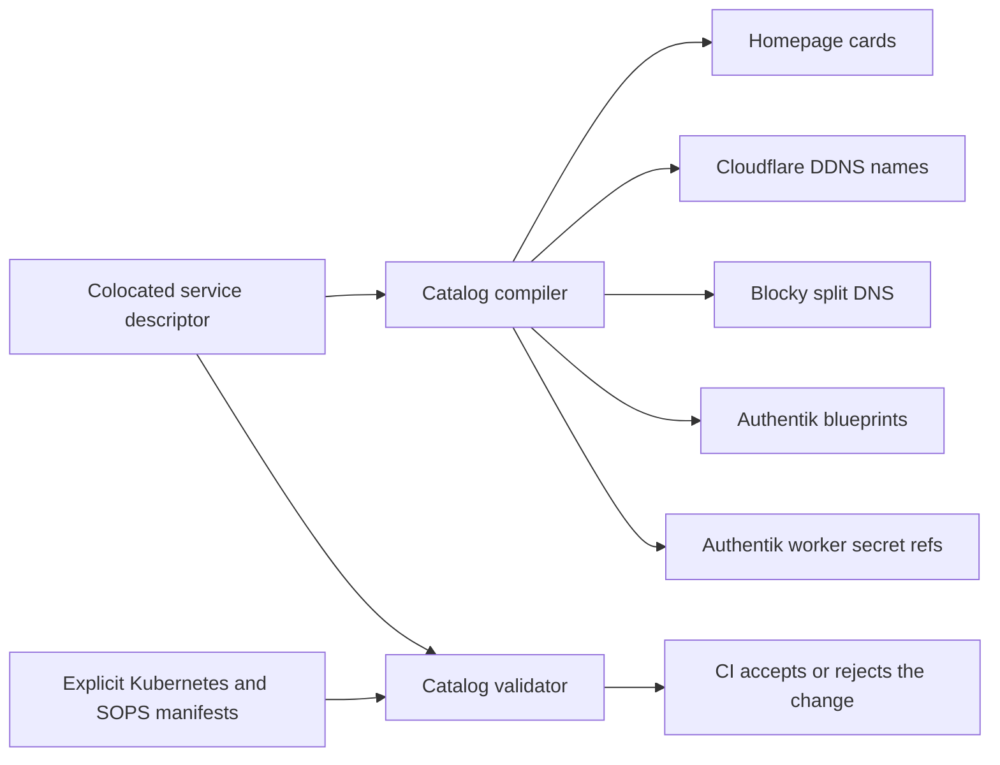

# Service integration catalog

This manual is for a maintainer adding or changing a cluster service. After
reading it, you should be able to make one colocated integration declaration,
generate all shared configuration, and distinguish what the compiler proved
from what still needs an application-specific decision or live test.

The short version is:

1. Put `<service-id>.catalog.yaml` beside the service's Kubernetes manifests.
2. State the exposure, login, placement, data-protection, monitoring, and
   Homepage decisions there.
3. Run `python3 scripts/service_catalog.py render`.
4. Read `python3 scripts/service_catalog.py explain <service-id>`.
5. Run `python3 scripts/service_catalog.py check`.

Do not add the hostname to Cloudflare DDNS or Blocky by hand. Do not add a
standard OIDC or forward-auth application directly to Authentik's aggregate
blueprint. Those are compiler outputs.

## Mental model

The catalog is a build-time contract. It is not a Kubernetes controller and it
does not run in the cluster.



Kubernetes manifests remain the cluster-runtime source of truth. The descriptor records
cross-service intent and lets the compiler remove repetitive integration
plumbing. This separation matters: the catalog must not invent a public route,
backup promise, node pin, callback, claim, role mapping, secret, or network
permission.

Application settings remain owned by each application's persistent data. The
[configuration ownership policy](configuration-ownership.md) defines that
boundary; the catalog must not be used to reintroduce application-database
reconciliation.

Cluster-wide facts live in `catalog/cluster.yaml`: the base domain, the
split-DNS address, Homepage group order, and the Authentik provider-secret
location. Service decisions never go into that file.

Every descriptor uses the versioned envelope
`catalog.reza.network/v1alpha1`. The JSON Schema comment on its first line gives
editors completion and catches misspelled or mode-incompatible fields. The
compiler repeats the security-sensitive checks in CI, so correctness does not
depend on one editor.

## What is generated

The compiler owns these committed, reviewable outputs:

| Output | Descriptor input |
| --- | --- |
| Homepage service inventory | Every enabled `homepage` block |
| Cloudflare DDNS domain list | Web entries with `dns.cloudflare: true` |
| Blocky split-DNS mappings | Web entries with `dns.splitHorizon: true` |
| Authentik application blueprint ConfigMap | OIDC and forward-auth declarations |
| Authentik worker environment patch | Confidential OIDC clients |

Generated files carry a warning header. Never edit them directly. `check`
compares them byte-for-byte with a fresh render and fails on drift.

`render` validates every descriptor before changing any output. It prepares all
content first and atomically replaces each file, so an invalid descriptor
cannot leave half of the shared configuration updated.

## What is not generated

These remain explicit because their behavior is service-specific:

- Deployments, StatefulSets, DaemonSets, Jobs, and Services;
- HTTPRoutes, Traefik middleware, access proxies, and NetworkPolicies;
- PVCs, NFS volumes, backup jobs, and restore procedures;
- the relying application's OIDC environment and authorization/role rules;
- SOPS-encrypted secret values;
- ServiceMonitors, PrometheusRules, alerts, and Grafana dashboards; and
- application bootstrap, mobile-client, webhook, API, and logout behavior.

The descriptor references these resources. CI proves that the referenced files,
hostnames, secret keys, pins, and monitoring/storage declarations exist and
agree with the rendered cluster where that can be checked mechanically.

For example, CI can prove that a private route references an IP allow-list. It
cannot prove that an application's mobile client completes OIDC login or that
two independently SOPS-encrypted copies of a client secret hold the same
plaintext. Those remain live acceptance tests.

## Read an ordinary descriptor

This shortened example shows the normal shape:

```yaml
# yaml-language-server: $schema=../../catalog/service.schema.json
apiVersion: catalog.reza.network/v1alpha1
kind: Service
metadata:
  name: example
spec:
  name: Example
  workload:
    namespace: apps
    app: example
  homepage:
    order: 50
    group: Home & Identity
    icon: example.png
    description: Short operator-facing purpose
  web:
    hostname: example.reza.network
    route: apps/example/route.yaml
    visibility: private
    accessMiddleware: lan-vpn-only
    dns:
      cloudflare: true
      splitHorizon: true
    auth:
      mode: native
      reason: Example uses its supported local account authentication.
  placement:
    mode: floating
  data:
    class: longhorn
    protection: longhorn-b2
    manifests: [apps/example/pvc.yaml]
  observability:
    mode: kubernetes
```

The descriptor's directory is its owning application path. There is no repeated
`path` field and no central service list to update.

`metadata.name` is the stable machine identity. Do not rename it casually:
confidential Authentik secret keys are derived from it. `spec.name` is the
human-facing label and may change.

`workload` selects the pods Homepage should summarize. Use `app` for the normal
`app.kubernetes.io/name` label. Use `podSelector` only when a component spans
several labels or shares a pod.

`homepage.order` is local to its group. Leave gaps so a new card can be inserted
without renumbering everything. A deliberate omission is explicit:

```yaml
homepage:
  enabled: false
  reason: The dashboard does not need a card linking back to itself.
```

## Exposure and DNS

`visibility` has no default:

- `private` requires the named IP allow-list middleware and means LAN or
  WireGuard only.
- `public` means Internet-reachable and forbids an IP allow-list on the rendered
  route.

Every web entry explicitly says whether Cloudflare and Blocky own its DNS. This
is a policy decision, not an implementation list. The compiler turns those two
booleans into the central provider-specific configuration.

Authentication modes are:

- `oidc`: generate an Authentik provider and application using the immutable
  `authentik-oidc-v1` profile;
- `forward-auth`: generate an Authentik single-application proxy provider using
  `authentik-forward-single-v1`, or use `authentik-forward-single-v2` with a
  required `allowedGroups` list when the application also needs group-level
  authorization;
- `native`: use the application's supported authentication and document why
  native OIDC is unavailable or unsuitable; or
- `none`: only permitted on a private route and requires a reason.

An unauthenticated public route is rejected.

## Native OIDC

Use native OIDC whenever the application supports it. A confidential-client
example is:

```yaml
auth:
  mode: oidc
  profile: authentik-oidc-v1
  application:
    slug: example
    launchUrl: https://example.reza.network/
  client:
    type: confidential
    id: example
    grantTypes: [authorization_code, refresh_token]
    scopes: [openid, email, profile]
    redirectUris:
      - type: authorization
        url: https://example.reza.network/oauth/callback
    secret:
      manifest: apps/example/secrets.sops.yaml
      key: oidc-client-secret
```

The profile fixes only Authentik mechanics: standard authorization/invalidation
flows, strict redirects, a per-provider issuer, ID-token claims, and the signing
key. It does not choose client type, grants, scopes, callbacks, claims, or
visibility.

For a confidential client, the compiler derives
`AUTHENTIK_OIDC_<SERVICE_ID>_CLIENT_SECRET`, checks that the key exists in the
shared encrypted Authentik Secret, checks the relying-party Secret reference,
and generates the worker's required `secretKeyRef`. It never creates or prints
the secret value.

When an application stores its relying-party secret in its own backed-up
database, declare `secret.managedBy: application-state` with a reason instead
of inventing a redundant Kubernetes Secret. The compiler still validates the
Authentik provider copy. Rotation then requires a coordinated application UI
change and provider-secret change; Flux must not overwrite the application.

A public client must supply reviewed PKCE evidence and cannot declare a secret:

```yaml
client:
  type: public
  id: example-mobile
  grantTypes: [authorization_code]
  scopes: [openid, email, profile]
  redirectUris:
    - type: authorization
      url: https://example.reza.network/oidc/callback
  pkce:
    verified: true
    evidence: Upstream version 2.5 implements authorization code with PKCE.
```

Redirects must be exact HTTPS URLs on the service hostname. Wildcards, regexes,
cross-host redirects, implicit flow, and client credentials are not supported
by the standard profile. A genuine future exception requires a reviewed,
versioned compiler extension rather than a raw-YAML escape hatch.

### Custom claims

Most services need only managed `openid`, `email`, and `profile` scopes.
Applications with a documented claim requirement may add a typed mapping:

```yaml
claimMappings:
  - id: example-profile
    name: Example preferred username
    scope: profile
    description: Example keys users by preferred_username.
    reason: Email is the application's stable user identity.
    expression: |
      return {"preferred_username": request.user.email}
```

The reason is mandatory because the expression is executable Authentik policy.
Actual Budget and Headlamp are the current examples. Audiobookshelf demonstrates
multiple authorization and logout callbacks. Grafana role mapping remains in
Grafana's own configuration because it is relying-party authorization, not
identity-provider plumbing.

## Forward-auth

Forward-auth is for a browser application that lacks native authentication and
whose APIs, WebSockets, callbacks, and clients are known to tolerate the proxy:

```yaml
auth:
  mode: forward-auth
  profile: authentik-forward-single-v1
  application:
    slug: example
    launchUrl: https://example.reza.network/
  middleware: example-authentik
```

The compiler generates the Authentik proxy provider, application, and embedded
outpost membership. The HTTPRoute and Traefik `forwardAuth` middleware remain
explicit and are validated. Homepage is the current example.

## Placement, data, and monitoring

Placement modes are `floating`, `beelink`, `raspberrypi`, `every-node`, and
`platform`. A physical-node pin references the manifest containing its hostname
selector. Every non-floating mode has a reason because it is an availability
decision.

Data classes are `stateless`, `longhorn`, `longhorn-observability`,
`nfs-reproducible`, `mixed`, and `platform`. Protection is stated separately:

- `longhorn-b2`;
- `longhorn-and-restic-b2`;
- `excluded-reproducible`;
- `excluded-observability`;
- `not-applicable`; or
- `platform-managed`.

Stateful classes reference their storage manifests. Mixed/excluded/platform
declarations also explain the boundary. A declaration records policy; backup
health and restore tests remain operational evidence.

Observability modes are:

- `kubernetes`: pod health and CPU/memory only;
- `metrics`: application metrics with referenced monitoring resources;
- `platform`: shared platform monitoring resources; or
- `none`: an explicit reason.

Do not claim `metrics` merely because kube-state-metrics can see a pod.

## Add a service

1. Build the application manifests using the service lifecycle manual. Add the
   application directory to the root Kustomization.
2. Add `<service-id>.catalog.yaml` beside those manifests. Copy the closest
   security and storage shape, then replace every value. Do not copy a
   privileged exception into an ordinary app.
3. Decide, rather than infer:
   - public, private, or no route;
   - native OIDC, forward-auth, native login, or no login;
   - exact callbacks/scopes/client type;
   - floating or physical placement;
   - each state store and its off-site protection; and
   - Kubernetes-only, application metrics, platform, or no monitoring.
4. For confidential OIDC, create the provider copy in the shared Authentik SOPS
   Secret. If Kubernetes supplies the relying-party value, create the same value
   in that application's SOPS Secret and declare its manifest/key. If the
   supported application UI stores it, declare
   `secret.managedBy: application-state` with a reason and plan the separately
   authorized UI operation. Do not create a redundant second owner or print the
   value in a transcript.
5. Render:

   ```bash
   python3 scripts/service_catalog.py render
   ```

6. Ask the compiler to explain the result:

   ```bash
   python3 scripts/service_catalog.py explain <service-id>
   ```

   Read both sections: “Generated by the catalog compiler” and “Validated but
   still explicitly owned by manifests.” If a required responsibility is in
   the second section, complete it before deployment.

7. Validate the final rendered cluster:

   ```bash
   kubectl kustomize clusters/home-server >/tmp/home-server.yaml
   python3 scripts/service_catalog.py check --rendered /tmp/home-server.yaml
   python3 scripts/service_catalog.py summary
   ```

8. Follow the pull-request and live acceptance flow in the service lifecycle
   manual. For OIDC, test discovery, login, callback, logout, roles, and any
   official mobile client. For state, confirm backup inclusion and the relevant
   restore/read test.

You do not edit the generated Homepage, DDNS, Blocky, Authentik blueprint, or
worker-patch files during this workflow.

## Modify a service

Change the descriptor and its owning manifests in the same pull request. Run
`render`, inspect every generated diff, then run `explain` and `check`.

A hostname change affects routing, two DNS systems, Homepage, Authentik
callbacks, and often application-side settings. The compiler updates only the
areas it owns and rejects mismatched explicit resources.

Treat these as stable identities:

- `metadata.name`;
- Authentik application slug;
- OIDC client ID;
- provider/application identifiers derived from the slug; and
- confidential provider secret key derived from `metadata.name`.

Changing an identity is a migration, not a rename.

## Retire a service

Retirement remains deliberately explicit because the root Flux Kustomization
does not prune and Authentik does not delete objects merely because a mounted
blueprint file disappears.

1. Remove or disable the route and stop writers.
2. Take and verify the final backup if state is retained.
3. Explicitly delete the live Kubernetes objects according to the retirement
   runbook.
4. Remove the service descriptor and run `render`. This removes the generated
   `state: present` declaration but does not delete existing Authentik database
   objects.
5. Treat Authentik deletion as a separate application-state and destructive
   operation. The repository currently has no versioned catalog lifecycle field
   or tested generic cleanup declaration that enumerates providers,
   applications, mappings, policy bindings, and outpost membership. Retain and
   report those objects unless the change first adds such a tested mechanism or
   supplies a service-specific reviewed cleanup procedure.
6. If the directory remains registered only for recovery artifacts, replace
   the service descriptor with a colocated `CatalogExclusion` and a narrow
   reason.

A narrow exclusion is valid for a retained recovery-only module or an internal
support controller with no catalog-owned web, DNS, Homepage, auth, placement,
data-protection, or monitoring intent. Never use an exclusion to hide an active
service whose integration intent belongs in a Service descriptor.

## Understand failures

Common errors are phrased as the missing operational decision:

- `active app path has no catalog service or documented exclusion`: add a
  descriptor beside the app; do not add it to a central list.
- `generated file is stale`: run `render` and review the diff.
- `private route does not reference access middleware`: fix the HTTPRoute or
  correct the visibility decision.
- `cataloged public but route uses IP allow-list`: decide whether the service is
  actually public or private; do not silence the check.
- `providerSecret key is not present`: add the derived key to the encrypted
  Authentik Secret.
- `redirect URL must be exact`: register the upstream-documented callback on
  the service hostname.
- `must be a DNS label` or `contains unsafe characters`: use a plain stable
  identifier; generated Authentik and DNS syntax never accepts free-form YAML.
- `placement manifest does not pin`: fix the manifest or declare the workload
  floating.
- `unknown field`: use the schema spelling; unknown keys never act as comments.

For a plain-language view at any time:

```bash
python3 scripts/service_catalog.py explain <service-id>
```

## Schema and profile evolution

Descriptor API versions and integration profiles are separate:

- `catalog.reza.network/v1alpha1` defines the descriptor shape.
- `authentik-oidc-v1`, `authentik-forward-single-v1`, and
  `authentik-forward-single-v2` define generated provider behavior. Forward
  auth v2 adds a generated application policy binding for the descriptor's
  required `allowedGroups` list.

An existing profile version is immutable. New behavior gets a new profile
version and an explicit descriptor migration. The compiler never silently
reinterprets an old descriptor.

The catalog stays a build-time tool. Adding a CRD/controller, generating full
application workloads, or introducing generic inheritance would require a new
architecture decision; none is a routine extension.
